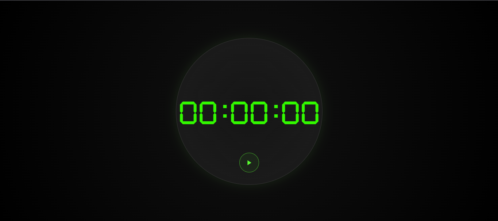

# 🌐 Timer

> A simple, clean, and responsive timer web application designed for ease of use and efficiency. This project provides a user-friendly interface for tracking time, whether you're studying, working, exercising, or managing daily tasks.

---

## 📸 Preview



🔗 **Live Demo:** https://samuel-fsilva.github.io/timer/

---

## 🚀 Features

- ✨ Counts downward from a time defined by the user to zero.
- ⚡ Start and pause functionality
- ⚙️ Customizable duration settings
- 🎨 Minimalist and distraction-free design

---

## 🛠️ Technologies

- HTML
- CSS
- JavaScript (Vanilla)

---

## 📦 Installation

```bash
# Clone the repository
git clone https://github.com/samuel-fsilva/timer.git

# Enter the folder
cd timer
```

---

## ▶️ Usage

Example:

- Download and unzip or clone the project using git into a folder
- Open the folder named `timer`, then open `index.html` in your browser
- Enjoy!

---

## 📁 Project Structure

```
timer/
│── assets/
│   └── fonts/
│   └── images/
│   └── ringtones/
│   └── scripts/
│       └── app.js
│   └── styles/
│       └── animations.css
│       └── font.css
│       └── style.css
│── index.html
│── style.css
│── 
│── README.md
```

---

## 🗺️ Roadmap

- [ ] Add end timer notifications functionality
- [ ] Improve UI with themes (Light/Dark)
- [ ] Add the possibility to turn the timer into a stopwatch
- [ ] Mobile version 

---

## 🙋‍♂️ Author

- GitHub: https://github.com/samuel-fsilva

---
